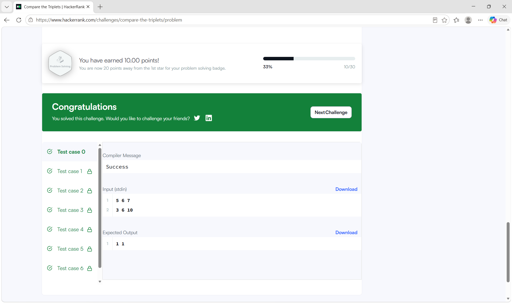
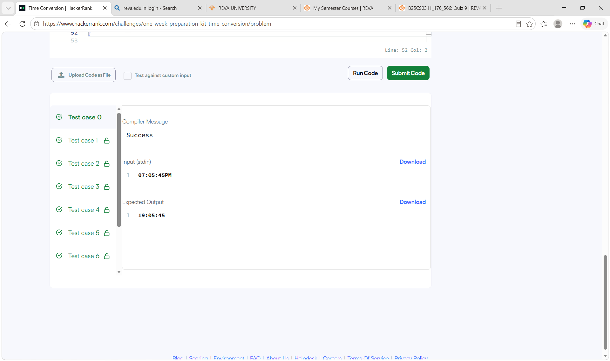
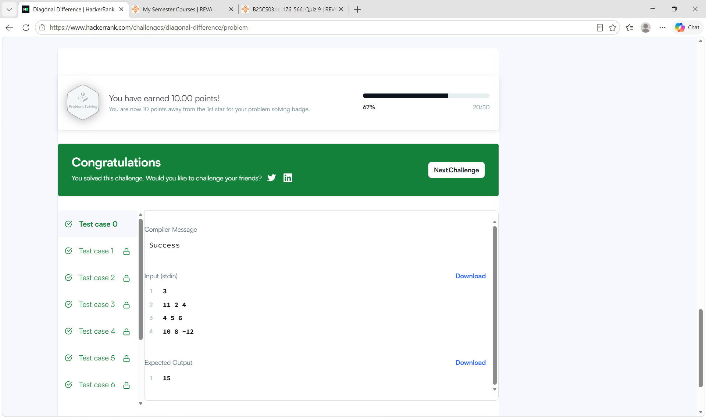
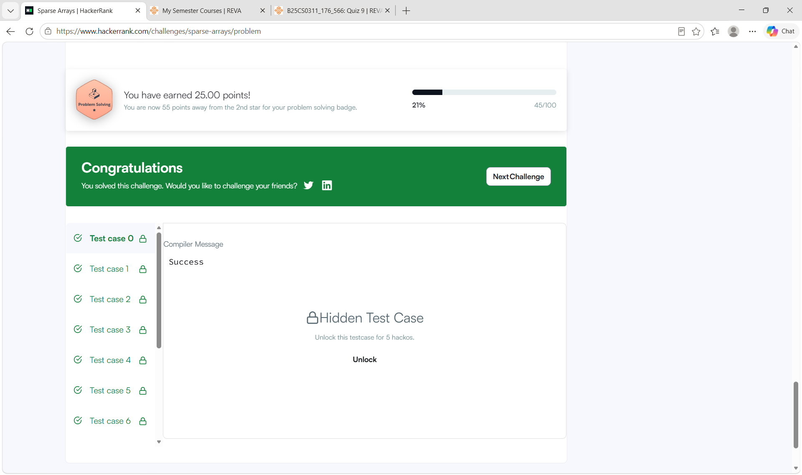
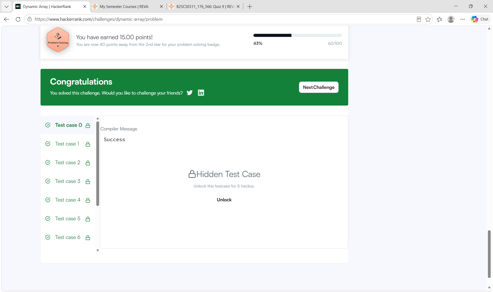
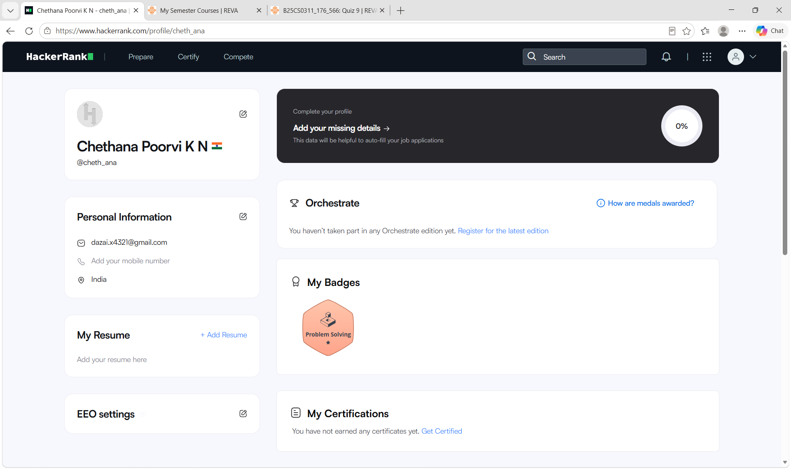

# HackerRank-3rdSem-Portfolio
"HackerRank algorithmic problem-solving portfolio for Activity 8."

# HackerRank 3rd Sem Portfolio — Activity 8

## About
This repository contains my solutions to 5 algorithmic problems on HackerRank, completed as part of Activity 8: Algorithmic Problem-Solving & Portfolio Integration.

## HackerRank Profile
[hackerrank.com/profile/cheth_ana](https://www.hackerrank.com/profile/cheth_ana)

## Problems Solved

| Problem | Time Complexity | Space Complexity |
|---|---|---|
| Compare the Triplets | O(1) | O(1) |
| Time Conversion | O(1) | O(1) |
| Diagonal Difference | O(N) | O(1) |
| Sparse Arrays | O(N+Q) | O(N) |
| Dynamic Array | O(N+Q) | O(N) |

## Badge Earned
Problem Solving — 1 Star

## Screenshots
Screenshots of each accepted submission and the earned badge are included below.

